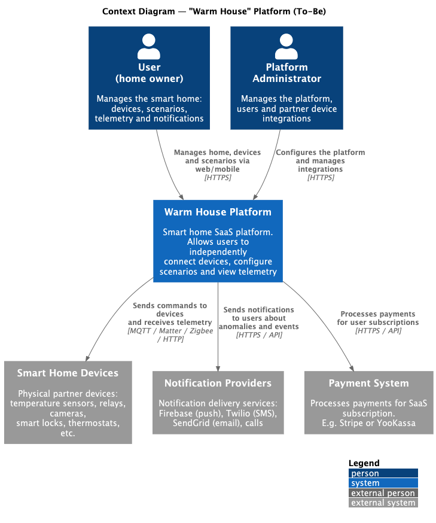

# Project_template

Это шаблон для решения проектной работы. Структура этого файла повторяет структуру заданий. Заполняйте его по мере работы над решением.

# Задание 1. Анализ и планирование

<aside>

Чтобы составить документ с описанием текущей архитектуры приложения, можно часть информации взять из описания компании и условия задания. Это нормально.

</aside>

### 1. Описание функциональности монолитного приложения

**Управление отоплением:**

- Технически API позволяет создавать датчики через POST-запрос, однако в текущем бизнес-процессе это происходит только
в рамках визита специалиста — самостоятельное подключение пользователем не предусмотрено на уровне процесса, а не кода.
- Система поддерживает включение и отключение датчиков.
- Система предоставляет возможность обновления показаний датчиков и их статуса (активный/неактивный).
- Управление отоплением происходит на основе данных, получаемых от датчиков температуры через синхронные HTTP-запросы.

**Мониторинг температуры:**

- Пользователи могут получать текущие показания температуры по конкретному датчику (по его ID).
- Система поддерживает запросы показаний температуры по названию комнаты (location): гостиная, спальня, кухня и др.
- Пользователи могут просматривать список всех датчиков с актуальными значениями температуры.
- Система получает данные о температуре от внешнего API (temperature-api) синхронно при каждом запросе.
- Для каждого датчика отображается: значение температуры, единицы измерения, статус, время последнего обновления.
- Система хранит информацию о датчиках в базе данных PostgreSQL, однако НЕ обновляет её при получении новых данных.
- Подключение датчиков возможно только через специалиста компании, самостоятельное подключение пользователями не поддерживается.

### 2. Анализ архитектуры монолитного приложения

**Язык программирования**: Go

**Веб-фреймворк**: Gin - HTTP веб-фреймворк для построения REST API

**База данных**: PostgreSQL с использованием пула соединений (pgx/v5/pgxpool)

**Архитектура**: 
- Монолитная
- Все компоненты системы (обработка HTTP-запросов, бизнес-логика, работа с данными) находятся в рамках одного приложения
- Структура проекта организована по слоям:
  - **db** - слой работы с базой данных, но нельзя подменить реализацию
  - **handlers** - обработчики HTTP-запросов, однако содержат кучу бизнес-логики
  - **models** - модели данных и их структуры
  - **services** - предназначен для бизнес-логики, но используется по большей части как клиент для интеграции с внешними API

**Взаимодействие**: 
- Синхронное взаимодействие между всеми компонентами
- REST API для внешних клиентов
- Запросы к внешнему temperature-api выполняются синхронно при каждом обращении
- Прямые SQL-запросы для работы с БД через пул соединений
- Все запросы обрабатываются последовательно в рамках одного HTTP-соединения

**Модель данных**:
- Единственная таблица `sensors` с полями: id, name, type, location, value, unit, status, last_updated, created_at
- Индексы созданы для оптимизации запросов по type, location и status
- Поддерживается только тип датчиков `temperature`

**API endpoints**:
- `GET /api/v1/sensors` - получение списка всех датчиков
- `GET /api/v1/sensors/:id` - получение датчика по ID
- `POST /api/v1/sensors` - создание нового датчика
- `PUT /api/v1/sensors/:id` - обновление датчика
- `DELETE /api/v1/sensors/:id` - удаление датчика
- `PATCH /api/v1/sensors/:id/value` - обновление показаний датчика
- `GET /api/v1/sensors/temperature/:location` - получение температуры по локации

**Масштабируемость**: 
- Ограничена вертикальным масштабированием (увеличение ресурсов сервера)
- Невозможно масштабировать отдельные компоненты независимо
- При росте нагрузки требуется масштабирование всего приложения целиком
- Внешний temperature-api является узким местом из-за синхронных вызовов

**Развертывание**: 
- Монолитное приложение, упакованное в Docker-контейнер
- Требует остановки всего приложения при обновлении любой части функционала
- Зависимость от PostgreSQL, которая также должна быть развёрнута
- Использование docker-compose для оркестрации контейнеров

**Надёжность и отказоустойчивость**:
- Graceful shutdown реализован (плюс-минус корректное завершение работы при получении сигналов SIGINT/SIGTERM, не идеальное, можно лучше)
- Отсутствует механизм повторных попыток при сбоях внешних API
- Нет кэширования данных
- Отсутствует обработка ситуаций с недоступностью temperature-api

**Найденные проблемы**:
- Не прокинут нигде `context.Context` для остановки обработки в случае прерывания (запроса или остановки сервера)
- Отсутствует интерфейс репозитория — реализация БД не абстрагирована через интерфейс, что делает невозможным подмену хранилища без рефакторинга
  - Подмена PostgreSQL на другую БД требует рефакторинг всего приложения, где используются запросы в БД
- HTTP-хендлеры содержат много бизнес-логики, которая должна находиться в сервисном слое
- Нет аутентификации и авторизации пользователей. Все пользователи видят все датчики и управляют всеми датчиками (создают, обновляют и удаляют)
- После синхронного получения данных о температуре датчика эти данные выводятся пользователю, однако не сохраняются в БД
- Отсутствие unit- и integration-тестов

### 3. Определение доменов и границы контекстов

На основе анализа текущей системы и требований к целевой экосистеме были выделены следующие домены и ограниченные контексты (Bounded Contexts):

#### Домен **SmartHome**

Поддомены:
- **Home management**
  - Home management Context: позволяет создать дом, комнаты в нём
  - Invitation Context: приглашает определённых пользователей в дом
- **User management** 
  - Sign up/in Context: создаёт или аутентифицирует пользователей
  - Role Context: выдаёт конкретные права жильцам дома
- **Device management**
  - Adding device Context: позволяет подключить новое устройство
  - Attachment Context: позволяет присоединить устройство к дому и комнате, или же отвязать его
  - State Context: позволяет управлять устройством (включить/выключить, выполнить команду и т.д.)
- **Telemetry**
  - Measurement Context: собирает данные всех датчиков в реальном времени
  - Anomaly monitoring Context: обрабатывает данные от датчиков на предмет выявления аномалий, отправляет уведомления об изменениях датчиков
- **Script management**
  - Script Context: управление сценариями (создание, обновление, добавление устройств и условий)
  - Schedule Context: управление расписанием (триггерит сценарии по расписанию)
  - Trigger Context: подписывается на какой-то триггер и запускает сценарий, если такой триггер приходит
- **Notification management**
  - Channel Context: управление каналами уведомлений для пользователя (SMS, push-уведомление, email, звонок на телефон)
  - Subscription Context: управляет подписками на определённые события
  - Alert Context: ловит события об аномалиях и шлёт алёрты пользователям через экстренные каналы связи (push -> SMS -> звонок)
  - Info Context: отправляет информационные сообщения пользователю (кто-то зашёл в дом, обнаружено движение на камерах и т.д.)

#### Домен **Device Integrations**

Поддомен:
- **Integration management**
  - Protocol Context: подключение протоколов связей через единый интерфейс. Протоколы: WiFi, Zigbee, Matter и др.
  - Device Type Context: управления типами девайсов в системе (освещение, розетки, камеры, датчики, кондиционеры и т.д.)

#### Домен **Billing System**

Поддомены:
- **Payment management**
  - Payment Context: списывает деньги за подписку через внешние платёжные сервисы
  - Audit Context: хранит всю историю платежей
- **Subscription management**
  - Subscription Context: управление подпиской (активация, заморозка, остановка подписки)
  - Plans Context: управление тарифными планами
  - Verifying Context: проверяет есть ли у пользователя активная подписка. Если нет, то не выдаёт доступ к системе

### **4. Проблемы монолитного решения**

- **Невозможность независимого масштабирования**: при росте нагрузки на конкретный функционал (например, получение данных с датчиков) приходится масштабировать всё приложение целиком
- **Синхронные вызовы внешнего API**: каждый запрос блокирует поток в ожидании ответа от temperature-api, что создаёт узкое место и снижает производительность при высокой нагрузке
- **Отсутствие отказоустойчивости**: нет механизмов повторных попыток, кэширования и обработки недоступности внешних сервисов - падение temperature-api приводит к отказу всей системы
- **Сложность развёртывания**: любое изменение требует пересборки и перезапуска всего приложения, что увеличивает риски и время простоя
- **Связанность с БД**: прямые SQL-запросы по всему коду делают невозможной смену СУБД без масштабного рефакторинга
- **Смешение ответственности**: бизнес-логика размазана между handlers и services, что затрудняет тестирование и поддержку кода

Также см. раздел "**Найденные проблемы**" во 2-м под-задании задания 1 выше.

### 5. Визуализация контекста системы — диаграмма С4

[C4 Контекстная диаграмма новой системы на сайте PlantULM](https://editor.plantuml.com/uml/TLNBRjj84BphAtfr2GN84XR8oPUDr_R6njg9ifGHP270699jSR3p46Q6OdJBH-GByoLRmvSeEG4CM-mPLrTrLLFlV10kL5hHzTldQsi2VmsJD_J0UrRqE_tuzftIWm-iwNXuPNpDpbzINLggF7iA9PDlhmbJe2xpad2PdH6gE_5KM5oLWII0dCW3rJAKVqJ000JfIJLT8nYR81tJJedmOfqc70hoqcmLKsQ_DhmQ6E17O38sa1O1bSNaDsboLHLCPGWxVxbSEb4ljkXLPM3hyYZ4X4LkzH8DJ5H_uKEXPBQyVdknYgMdnuUb5g3jbiUvB7QuEPayN7tv-BH-_do_ldj-k7r_--4ccKqcGGPmwsxIZHHR9tJ3S_fPGC6THUyfhNf5oTfU_CdunpVqu_ktzgSVTMJfZ-N92e_M9B4yf-aJ_cnCKbhDP6l3RZP5zL4OiUsjqF2KueNBZIbuBtFsS_8v6-6azVCDI2hM7DoXyGl3aoyo5q5QuwUplfyej3I0xZblp5MiI1-S2DQTT-tD0dmh84Blm0GKgMMnCT4qJARlTAB-O-Nw51srjoD96abtK3GVptCOP-II3gef5I8T-2p0MobR-swkmI8w1UyOlqnGXur18WmZZyEeK7YHsyg1y32rHivUSat3yCu5t9ud_bp6CsuaGvUESLH5DsqnwbYL1myprDdi_6MqJU-mEW7CoBFnrW76iHA7I5fed4LtM_-LpVz36TOuRR7c0GySyWLOZzYClLyvkvS5Hz3fXr6TXeFf-Kd1IkuPES9eUvP_ONKp0NUINUNBsPpMjLJIKf8-fZFGIp7vzquMbB0MKiqYTQNyAQ-TE6ZOqrRYLDhdRaMQEJcBVl7rqztr1BjRxtsL-Tp9NUG8_syNsmMb0GMiZAClrlujl1Vd_jrtBwOOpf5t_x3gTc-SmZxwPVFOURGnCIN7pEobe9gpfRQPL1nPtwtNgnID8sYtO6FKwpvvfplLukgkvSaIZJ0Rq17QA6aOkKUiDI2APWLE23lE6JRwKRIZma_hDItfiNcjuiE_SfinuqFirqaOTVjLajhU9-yO9DbssoWoMmNibjL2IMwt35y3S7DGXevNg_lN3Lz5v5KWDYOc8ZOwISHFe2Vlm3A-tly7)

[C4 Контекстная диаграмма новой системы в папке со схемами](schemas/c4_context.puml)



# Задание 2. Проектирование микросервисной архитектуры

В этом задании вам нужно предоставить только диаграммы в модели C4. Мы не просим вас отдельно описывать получившиеся микросервисы и то, как вы определили взаимодействия между компонентами To-Be системы. Если вы правильно подготовите диаграммы C4, они и так это покажут.

**Диаграмма контейнеров (Containers)**

Добавьте диаграмму.

**Диаграмма компонентов (Components)**

Добавьте диаграмму для каждого из выделенных микросервисов.

**Диаграмма кода (Code)**

Добавьте одну диаграмму или несколько.

# Задание 3. Разработка ER-диаграммы

Добавьте сюда ER-диаграмму. Она должна отражать ключевые сущности системы, их атрибуты и тип связей между ними.

# Задание 4. Создание и документирование API

### 1. Тип API

Укажите, какой тип API вы будете использовать для взаимодействия микросервисов. Объясните своё решение.

### 2. Документация API

Здесь приложите ссылки на документацию API для микросервисов, которые вы спроектировали в первой части проектной работы. Для документирования используйте Swagger/OpenAPI или AsyncAPI.

# Задание 5. Работа с docker и docker-compose

Перейдите в apps.

Там находится приложение-монолит для работы с датчиками температуры. В README.md описано как запустить решение.

Вам нужно:

1) сделать простое приложение temperature-api на любом удобном для вас языке программирования, которое при запросе /temperature?location= будет отдавать рандомное значение температуры.

Locations - название комнаты, sensorId - идентификатор названия комнаты

```
	// If no location is provided, use a default based on sensor ID
	if location == "" {
		switch sensorID {
		case "1":
			location = "Living Room"
		case "2":
			location = "Bedroom"
		case "3":
			location = "Kitchen"
		default:
			location = "Unknown"
		}
	}

	// If no sensor ID is provided, generate one based on location
	if sensorID == "" {
		switch location {
		case "Living Room":
			sensorID = "1"
		case "Bedroom":
			sensorID = "2"
		case "Kitchen":
			sensorID = "3"
		default:
			sensorID = "0"
		}
	}
```

2) Приложение следует упаковать в Docker и добавить в docker-compose. Порт по умолчанию должен быть 8081

3) Кроме того для smart_home приложения требуется база данных - добавьте в docker-compose файл настройки для запуска postgres с указанием скрипта инициализации ./smart_home/init.sql

Для проверки можно использовать Postman коллекцию smarthome-api.postman_collection.json и вызвать:

- Create Sensor
- Get All Sensors

Должно при каждом вызове отображаться разное значение температуры

Ревьюер будет проверять точно так же.


# **Задание 6. Разработка MVP**

Необходимо создать новые микросервисы и обеспечить их интеграции с существующим монолитом для плавного перехода к микросервисной архитектуре. 

### **Что нужно сделать**

1. Создайте новые микросервисы для управления телеметрией и устройствами (с простейшей логикой), которые будут интегрированы с существующим монолитным приложением. Каждый микросервис на своем ООП языке.
2. Обеспечьте взаимодействие между микросервисами и монолитом (при желании с помощью брокера сообщений), чтобы постепенно перенести функциональность из монолита в микросервисы. 

В результате у вас должны быть созданы Dockerfiles и docker-compose для запуска микросервисов. 
