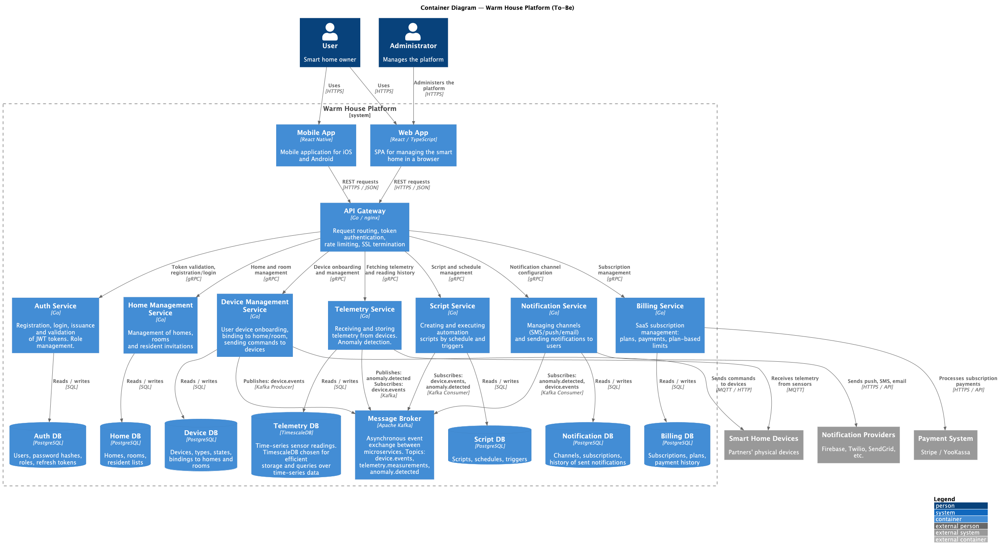
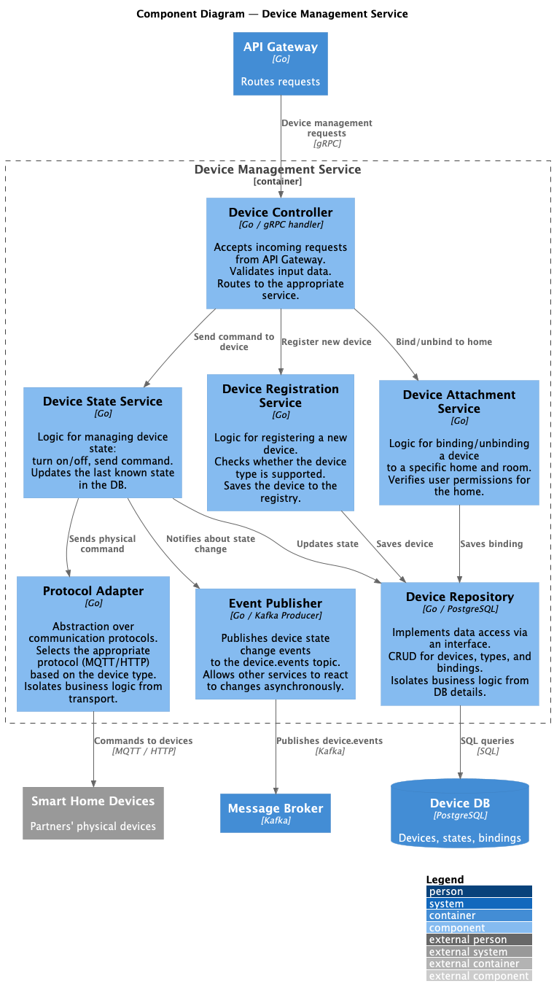
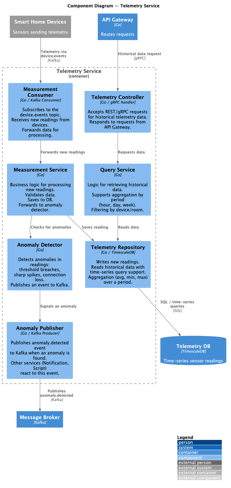
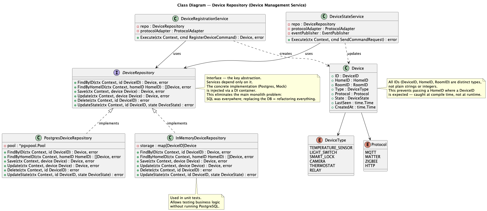

# Project_template

Это шаблон для решения проектной работы. Структура этого файла повторяет структуру заданий. Заполняйте его по мере работы над решением.

# Задание 1. Анализ и планирование

<aside>

Чтобы составить документ с описанием текущей архитектуры приложения, можно часть информации взять из описания компании и условия задания. Это нормально.

</aside>

### 1. Описание функциональности монолитного приложения

**Управление отоплением:**

- Технически API позволяет создавать датчики через POST-запрос, однако в текущем бизнес-процессе это происходит только
в рамках визита специалиста — самостоятельное подключение пользователем не предусмотрено на уровне процесса, а не кода.
- Система поддерживает включение и отключение датчиков.
- Система предоставляет возможность обновления показаний датчиков и их статуса (активный/неактивный).
- Управление отоплением происходит на основе данных, получаемых от датчиков температуры через синхронные HTTP-запросы.

**Мониторинг температуры:**

- Пользователи могут получать текущие показания температуры по конкретному датчику (по его ID).
- Система поддерживает запросы показаний температуры по названию комнаты (location): гостиная, спальня, кухня и др.
- Пользователи могут просматривать список всех датчиков с актуальными значениями температуры.
- Система получает данные о температуре от внешнего API (temperature-api) синхронно при каждом запросе.
- Для каждого датчика отображается: значение температуры, единицы измерения, статус, время последнего обновления.
- Система хранит информацию о датчиках в базе данных PostgreSQL, однако НЕ обновляет её при получении новых данных.
- Подключение датчиков возможно только через специалиста компании, самостоятельное подключение пользователями не поддерживается.

### 2. Анализ архитектуры монолитного приложения

**Язык программирования**: Go

**Веб-фреймворк**: Gin - HTTP веб-фреймворк для построения REST API

**База данных**: PostgreSQL с использованием пула соединений (pgx/v5/pgxpool)

**Архитектура**: 
- Монолитная
- Все компоненты системы (обработка HTTP-запросов, бизнес-логика, работа с данными) находятся в рамках одного приложения
- Структура проекта организована по слоям:
  - **db** - слой работы с базой данных, но нельзя подменить реализацию
  - **handlers** - обработчики HTTP-запросов, однако содержат кучу бизнес-логики
  - **models** - модели данных и их структуры
  - **services** - предназначен для бизнес-логики, но используется по большей части как клиент для интеграции с внешними API

**Взаимодействие**: 
- Синхронное взаимодействие между всеми компонентами
- REST API для внешних клиентов
- Запросы к внешнему temperature-api выполняются синхронно при каждом обращении
- Прямые SQL-запросы для работы с БД через пул соединений
- Все запросы обрабатываются последовательно в рамках одного HTTP-соединения

**Модель данных**:
- Единственная таблица `sensors` с полями: id, name, type, location, value, unit, status, last_updated, created_at
- Индексы созданы для оптимизации запросов по type, location и status
- Поддерживается только тип датчиков `temperature`

**API endpoints**:
- `GET /api/v1/sensors` - получение списка всех датчиков
- `GET /api/v1/sensors/:id` - получение датчика по ID
- `POST /api/v1/sensors` - создание нового датчика
- `PUT /api/v1/sensors/:id` - обновление датчика
- `DELETE /api/v1/sensors/:id` - удаление датчика
- `PATCH /api/v1/sensors/:id/value` - обновление показаний датчика
- `GET /api/v1/sensors/temperature/:location` - получение температуры по локации

**Масштабируемость**: 
- Ограничена вертикальным масштабированием (увеличение ресурсов сервера)
- Невозможно масштабировать отдельные компоненты независимо
- При росте нагрузки требуется масштабирование всего приложения целиком
- Внешний temperature-api является узким местом из-за синхронных вызовов

**Развертывание**: 
- Монолитное приложение, упакованное в Docker-контейнер
- Требует остановки всего приложения при обновлении любой части функционала
- Зависимость от PostgreSQL, которая также должна быть развёрнута
- Использование docker-compose для оркестрации контейнеров

**Надёжность и отказоустойчивость**:
- Graceful shutdown реализован (плюс-минус корректное завершение работы при получении сигналов SIGINT/SIGTERM, не идеальное, можно лучше)
- Отсутствует механизм повторных попыток при сбоях внешних API
- Нет кэширования данных
- Отсутствует обработка ситуаций с недоступностью temperature-api

**Найденные проблемы**:
- Не прокинут нигде `context.Context` для остановки обработки в случае прерывания (запроса или остановки сервера)
- Отсутствует интерфейс репозитория — реализация БД не абстрагирована через интерфейс, что делает невозможным подмену хранилища без рефакторинга
  - Подмена PostgreSQL на другую БД требует рефакторинг всего приложения, где используются запросы в БД
- HTTP-хендлеры содержат много бизнес-логики, которая должна находиться в сервисном слое
- Нет аутентификации и авторизации пользователей. Все пользователи видят все датчики и управляют всеми датчиками (создают, обновляют и удаляют)
- После синхронного получения данных о температуре датчика эти данные выводятся пользователю, однако не сохраняются в БД
- Отсутствие unit- и integration-тестов

### 3. Определение доменов и границы контекстов

На основе анализа текущей системы и требований к целевой экосистеме были выделены следующие домены и ограниченные контексты (Bounded Contexts):

#### Домен **SmartHome**

Поддомены:
- **Home management**
  - Home management Context: позволяет создать дом, комнаты в нём
  - Invitation Context: приглашает определённых пользователей в дом
- **User management** 
  - Sign up/in Context: создаёт или аутентифицирует пользователей
  - Role Context: выдаёт конкретные права жильцам дома
- **Device management**
  - Adding device Context: позволяет подключить новое устройство
  - Attachment Context: позволяет присоединить устройство к дому и комнате, или же отвязать его
  - State Context: позволяет управлять устройством (включить/выключить, выполнить команду и т.д.)
- **Telemetry**
  - Measurement Context: собирает данные всех датчиков в реальном времени
  - Anomaly monitoring Context: обрабатывает данные от датчиков на предмет выявления аномалий, отправляет уведомления об изменениях датчиков
- **Script management**
  - Script Context: управление сценариями (создание, обновление, добавление устройств и условий)
  - Schedule Context: управление расписанием (триггерит сценарии по расписанию)
  - Trigger Context: подписывается на какой-то триггер и запускает сценарий, если такой триггер приходит
- **Notification management**
  - Channel Context: управление каналами уведомлений для пользователя (SMS, push-уведомление, email, звонок на телефон)
  - Subscription Context: управляет подписками на определённые события
  - Alert Context: ловит события об аномалиях и шлёт алёрты пользователям через экстренные каналы связи (push -> SMS -> звонок)
  - Info Context: отправляет информационные сообщения пользователю (кто-то зашёл в дом, обнаружено движение на камерах и т.д.)

#### Домен **Device Integrations**

Поддомен:
- **Integration management**
  - Protocol Context: подключение протоколов связей через единый интерфейс. Протоколы: WiFi, Zigbee, Matter и др.
  - Device Type Context: управления типами девайсов в системе (освещение, розетки, камеры, датчики, кондиционеры и т.д.)

#### Домен **Billing System**

Поддомены:
- **Payment management**
  - Payment Context: списывает деньги за подписку через внешние платёжные сервисы
  - Audit Context: хранит всю историю платежей
- **Subscription management**
  - Subscription Context: управление подпиской (активация, заморозка, остановка подписки)
  - Plans Context: управление тарифными планами
  - Verifying Context: проверяет есть ли у пользователя активная подписка. Если нет, то не выдаёт доступ к системе

### **4. Проблемы монолитного решения**

- **Невозможность независимого масштабирования**: при росте нагрузки на конкретный функционал (например, получение данных с датчиков) приходится масштабировать всё приложение целиком
- **Синхронные вызовы внешнего API**: каждый запрос блокирует поток в ожидании ответа от temperature-api, что создаёт узкое место и снижает производительность при высокой нагрузке
- **Отсутствие отказоустойчивости**: нет механизмов повторных попыток, кэширования и обработки недоступности внешних сервисов - падение temperature-api приводит к отказу всей системы
- **Сложность развёртывания**: любое изменение требует пересборки и перезапуска всего приложения, что увеличивает риски и время простоя
- **Связанность с БД**: прямые SQL-запросы по всему коду делают невозможной смену СУБД без масштабного рефакторинга
- **Смешение ответственности**: бизнес-логика размазана между handlers и services, что затрудняет тестирование и поддержку кода

Также см. раздел "**Найденные проблемы**" во 2-м под-задании задания 1 выше.

### 5. Визуализация контекста системы — диаграмма С4

[C4 Контекстная диаграмма новой системы на сайте PlantULM](https://editor.plantuml.com/uml/TLNBRjj84BphAtfr2GN84XR8oPUDr_R6njg9ifGHP270699jSR3p46Q6OdJBH-GByoLRmvSeEG4CM-mPLrTrLLFlV10kL5hHzTldQsi2VmsJD_J0UrRqE_tuzftIWm-iwNXuPNpDpbzINLggF7iA9PDlhmbJe2xpad2PdH6gE_5KM5oLWII0dCW3rJAKVqJ000JfIJLT8nYR81tJJedmOfqc70hoqcmLKsQ_DhmQ6E17O38sa1O1bSNaDsboLHLCPGWxVxbSEb4ljkXLPM3hyYZ4X4LkzH8DJ5H_uKEXPBQyVdknYgMdnuUb5g3jbiUvB7QuEPayN7tv-BH-_do_ldj-k7r_--4ccKqcGGPmwsxIZHHR9tJ3S_fPGC6THUyfhNf5oTfU_CdunpVqu_ktzgSVTMJfZ-N92e_M9B4yf-aJ_cnCKbhDP6l3RZP5zL4OiUsjqF2KueNBZIbuBtFsS_8v6-6azVCDI2hM7DoXyGl3aoyo5q5QuwUplfyej3I0xZblp5MiI1-S2DQTT-tD0dmh84Blm0GKgMMnCT4qJARlTAB-O-Nw51srjoD96abtK3GVptCOP-II3gef5I8T-2p0MobR-swkmI8w1UyOlqnGXur18WmZZyEeK7YHsyg1y32rHivUSat3yCu5t9ud_bp6CsuaGvUESLH5DsqnwbYL1myprDdi_6MqJU-mEW7CoBFnrW76iHA7I5fed4LtM_-LpVz36TOuRR7c0GySyWLOZzYClLyvkvS5Hz3fXr6TXeFf-Kd1IkuPES9eUvP_ONKp0NUINUNBsPpMjLJIKf8-fZFGIp7vzquMbB0MKiqYTQNyAQ-TE6ZOqrRYLDhdRaMQEJcBVl7rqztr1BjRxtsL-Tp9NUG8_syNsmMb0GMiZAClrlujl1Vd_jrtBwOOpf5t_x3gTc-SmZxwPVFOURGnCIN7pEobe9gpfRQPL1nPtwtNgnID8sYtO6FKwpvvfplLukgkvSaIZJ0Rq17QA6aOkKUiDI2APWLE23lE6JRwKRIZma_hDItfiNcjuiE_SfinuqFirqaOTVjLajhU9-yO9DbssoWoMmNibjL2IMwt35y3S7DGXevNg_lN3Lz5v5KWDYOc8ZOwISHFe2Vlm3A-tly7)

[C4 Контекстная диаграмма новой системы в папке со схемами](schemas/c4_context.puml)


# Задание 2. Проектирование микросервисной архитектуры

В этом задании вам нужно предоставить только диаграммы в модели C4. Мы не просим вас отдельно описывать получившиеся микросервисы и то, как вы определили взаимодействия между компонентами To-Be системы. Если вы правильно подготовите диаграммы C4, они и так это покажут.

## Диаграмма контейнеров (Containers)

Диаграмма показывает все разворачиваемые единицы (микросервисы, базы данных, брокер, клиентские приложения) и то, как они взаимодействуют между собой и с внешним миром.

Ключевые архитектурные решения:
- **Database per Service** — у каждого микросервиса своя БД, чтобы обеспечить независимое развёртывание и масштабирование.
- **API Gateway** — единая точка входа для клиентов. Снимает с микросервисов сквозные задачи: аутентификацию токенов, rate limiting, SSL-терминацию.
- **Message Broker (Kafka)** — асинхронное взаимодействие между сервисами для событий о состоянии устройств и аномалиях. Устраняет синхронную связность между сервисами.
- **TimescaleDB для телеметрии** — специализированная БД (построенная поверх PostgreSQL) для time-series данных, обеспечивает эффективное хранение и агрегацию показаний датчиков.
- **gRPC между Gateway и сервисами** — быстрый бинарный протокол для внутренних вызовов; REST (JSON) остаётся на уровне клиентских приложений.

[C4 Контейнерная диаграмма новой системы на сайте PlantUML](https://editor.plantuml.com/uml/bLZTZjis5hxtKvoTcva07XjOz2fNzOoJpBGpYJjo4AGm4D0InoOgaLgIiiSe5kZL0hqj-W1zjZn9po4fYP9bDni464iap_buVZv-rFV6Ccsh8eVRxxxSAccPa5oRqIKyy1tFuT_mzRS_eJFmir8526aLg4g3EHZBYmaaMxK7bkTWUCaqipm_GCRBN1tOEkTGIM7DQrnTY5Ghm_LEfDoCuLcZQIup_9anozRCqDk26yCs7DPQ_SBr19TTD10kq3U2XQ-__mLpbU8ufFNO1Euj20DC7d0MkaVBNDfZA9FHluHCyohZiBMsDA-dKytsausmssfT8RpKmRAJL1NJCcUIGdHjR9QBzVJsk-i5lVhu-30j66vVJ-FWJKgSEnezp3v_-BZyykb-UVVbuSsxD-_dLwz68oiiGcZcmbomZMQ5Y_8dfWkuK-WUqBvzLlXujLJNDnmNNiBNFt_p_-4Z0ZJjysY1ZqfU4UunND3e1VvD2imiR5N1GUqfSA_gYImhXCGPC_ehZCLqARVaaKaCkm6xvL0621SzvszUSCEIvP2upCSu_9ilEECguo710SOTmPZxb-HfWI-fdYwXt1wCID5UM8B-8ZjIMV6CmrOekT1g9p9SXElVH--X6I3BRuNcL4PZMEv5BjGO4go2TrfaO-0sdNJjb-nGO9xz6uVBFOVDkJ1QBKeEK_Yir8yCwx8Va0_O1Ks-Ze9neogPCNsuCXG72WFQ7CZqnIluTJG2_7S9jxaW3Amiyx15uqQQihdQy_MiBCaINmF-8g1FdAKMSIuF9KzI16qT_CKCq3uKb5eXDowtfYqDR2P6VROthaAwRWgr5ZdtdXxTxwwpzmXkno_QqGYoyoe-9DYC6SnaffN8A7H-Ymb2mVcuJNs0KY6Tz5opKhn35jcp0nNguXx24pbxft2R4dVpug7yf-B6WbQLHQjZi4WQkAiATofjG3DUII8bo4KX_AmaUG2iPEm0Dw65zXWpL1yL6aty4C729mYF7fV7i_4zHMuXLnlgDM5CnMJANJHsB1UP6rz9zGm_V5fwp6O2JmgZudB5gGudHocXfBK8N5izDjEFmKHZw8aMO_TeP72paWH5SoE88h4ETiBwMZlowJkpzUhx-AnV8g7GqQ3aMZ6TKTHNSesyxCfGEJHJmeAl3VUlaMznzvcXyPOGkd3mR46lM3WjecNzQYWTAHSxiatxDSXqpdsp04-WedOrMScPL0Lp1uRbAONZE0N6DLVht3VRiUTRpPcj7VCNdbR-gRBemcVVcpAmFe19jpohSbyXo3cR3H5QttVCXos23XiEru0BxfP9oNC3LybZCYqhivtoWedybQ-5EWUn3vS8EbYEeM33vpYzHN7ZNnm3I1XBm5Hhlrl2s5RuwvMaynMhCb0n_S8NryJXcUzNqpRdp1naYk715QNIVT88kk76oGRQUT0H_WL1cPKCumm_ikTVc7icUriK8KZ6W8e7Qvc_K9n8VN2xvnoprD4i4rYgKgJcTIYQYLjbi8QRcfeKd9bAyx0TvajguakAHomuhoKFN2c9HoxsJ73Z144zx0P2L7jPcAyT9ytNDHtDRzpngepTQ9xyz50temkmCNkbCzWoi-M4M2FR41_mP-I1RI2XVgBH1NMgS-6FyG4NTn6paE6QLdAamY6BFdREPc2J8QlpMaLOFDFm3ufLwu075Z4rZHZNDSxxWBCcCSvVonNUvLBWUXGWl7syne09D8eTOV0Kmpvstf0UeidOJbWK_fpZpzWmT6XZIoF3KCqH83oOd1srmmJQo31ftG6Wla4Soa0gGr7nGnIEG1aKe1E4WKRZTdQcEsmnvE0syCIuqxGKzwsWxHteB36KtWvL3FWE7E7SrlGmkAME7_2CWCmGr5XmYmx-EwY4__T7q4on6dtYUP34ZLh2wKuZtYsNYmIjjLDYfJCqAqZcnb8jdSbzHor7wpf86to8DKYP7jRQTaVvFBr9bbX_Jk6qe53-_91yU1-mHTZ_hxKTV0qcnDTHG17AosPMK33Xgk05rqumY1NHcCOab5gzY30nWA6kTUkOtd1RKvwFSxI1hjXQUYUDT78iqogjgHDQjClDq-AspbfaRK0urPo13D-SHsSid911hRpnn-WtsHhGC6_nThBjQ9DQeZdsQPhWjD4JmiITxO4gld6hto0pWfXOIRmgFujDvTDmnkQHNaY65K5aebEXlQh4EcsFpsudTGgdEHxnoeAwSWfxBQnlS28VZxDJ7CrfTsv5hnYYy-pSgkEqTy-cSsjxsOtEYdEh1ZDvT2ISiz3FMypffzRzG-Ay7kimIsYcu0NAQetIOKj7fHzmHpy4PUObrr0U-WfmKTlfoJM2waGWVJp8gjHTVY_Xw1uH0V4o3gdiH2RFkEuhm9KCjRy-3SpXwLujY0fIwqIFd-nQky7bQDNhW50TPgXm-ZXFGXaJ__IaQnCsFELDLOIm3Tq_t7N2z2uJNjJZf2Y3WnLw3cGV5E8yaTi8vF0th4zAvndSetJNBFKGkrGosERkivRRNNrTNSdelaeNZv-MIsmBEd1FTdvhorzHAO4jyxjhgTUVZSLlRUduGvd7INUzCU2jRmpknXUhWTdY_aId7tqSqme14z_6kh2HQUROwkXxT4-VG_y6)

[C4 Контейнерная диаграмма новой системы в папке со схемами](schemas/c4_containers.puml)



## Диаграмма компонентов (Components)

Ниже приведены диаграммы для двух ключевых микросервисов MVP: Device Management Service и Telemetry Service. Остальные сервисы построены по аналогичному паттерну: Controller (транспортный уровень) → Service → Repository.

*Device Management Service* — отвечает за весь жизненный цикл устройств: регистрацию, привязку к дому/комнате и управление состоянием.

[C4 Контейнерная диаграмма Device Management Service на сайте PlantUML](https://editor.plantuml.com/uml/XLRDRjiu4BxxAMPzQGAazc5xogd-2P9WdQvhErjq4S2W9TeY8f5Q3XMliLYW3z4dx9Fi34bBSgnq0oEIXZF3R_u-yYCwOLrLv33vi9wOeZHQQeVhgNnHYLnAou_UEvZ95vd3h_3ZstTerAuXwC63q68d2v91O_EdCGKexGm8GALtkOJ4Q2UKbdO0oypi8JSxbOYSvBLBCcGjQ_9SMhm23FuW5mTfhq2aedH-mShIe7B6Aec3tYzA9tcLIiYSA_5wEBHYFzWfbrMRYbomIt8_e8s6PIuqX_mUNPghpN3ouVsSHOyFis4XaBmFsyaObAJRwyr6Ntz_NAs_tA_krhERsvjFqulBNiyfHs7LkZ1LOcT5uVFqTcuenX_VluKVtFnDEsfAWioz5ZPhlSanNnUYLBV2oRquN45_DB-7-DMdprl3_nUcSX8fBNzL4XtsBnlhwUOYzM2c6rACkAPZjfeRT3ihbvzd_Ng9i-x8FJqtIgTKkXDl5uL4f936rZnpIVeFuHk2WFty9hRFWb_8RdcWb1Ph2ZE28BVzPK5j1tUca35DwC6Ga3R0Tr1c1_IT4Kt8pqdItinjgvMwyhWUcqgdmXuYbcZLPENSO_yI_kdrWFxgCaVZITsdZNqZ2vM18UmMymbaGgTHE4eIMH8ywbXJK7Bhai7MqiIqYZjuqd-8NALS2r8lAmVqBaWSYqspvJ89eYojAQqYlUEy33XZfw2jt2bqLZXbz5dSYzPY7NdTMpEUKzWQ2y69j8nRW9RxM272DCbayeompoHXiXvOM0DtA2Ke1ApAqbWdKz9UYXSEeAKKOeae3nq12ET4ad5jpk2FwgMVWO_TFAnqVACGmkvFaQPAcQWjQMVScLGoi4HYN0QAU4j40qmcK4fRA4HA5Ng_Z9ijEZ3xGJg3ksJfpv0Mt8OCC2R7kxacb9NLOFJGRBTCZGIGUeYKEQEFPMWKHfCJZy6pDdiTJAbxl7mwxi18pUDCOl9Hu5OUn2Y1A6eWZZRS9Obl4_D2kU3zAqspwaL7LyWL9a9B79vrw547BXu-hrR3kzLgVlcaDm9bIg6zxXjoT8yczv4HbTCG8uPp8umBeT78NTKH61rQsishJQumyt7Ti01gIJsYdg-0eawh98YFEdXI0KXeZedfl6FqJTF07GGfDNAf4e8zodEpHp1-6k9O-f6raXBeZOCx1847dMJMQ5DXtjNwOOV5ySWxj0VtAAkZEUNq-w8y7YnC7Y28VYY5BufUDP_Fqcv56E35uzHtNytJN01wy20SJuB_gyTqJEP4jjG25CQ_fxIzaBdlapOta-paT7kRMuk6c-jJZbQPNpbZxEZSk9lr5f76MWn6BhezTD7EcB8HQOGhoiF_flqh2bYsffPjwzszUIVSZke7-Zn1te7pJSDOpMXvYh33w4WjNh7Jw9n3E4vi3l8OSQVnsPn-CYxGhTZGGNSoUyT4dMtON2ucOIjiiklxXDc6feFv9g9ulU_hYyrh4eWJtjnmsYLl9wnrsw8f1EfLlgNsmoT7y96ImzVA_m00)

[C4 Контейнерная диаграмма Device Management Service в папке со схемами](schemas/c4_components_device_service.puml)



*Telemetry Service* — отвечает за приём телеметрии от устройств через Kafka, хранение показаний в TimescaleDB и детектирование аномалий.

[C4 Контейнерная диаграмма Telemetry Service на сайте PlantUML](https://editor.plantuml.com/uml/VLRRZjis47ttLqptfJQmQpyqJ_kKjRtT3UeaNjjfKC20GKcp4c69L4dAZbCKo4Va2_Cb7LBKrKeNna8SpUNCcGlrLXkcJ96bi7XpMCWibmA5qOSTffYXKPSjgXCFSVGhhF24AVm6FxvzXqRp7cfLQ7Ht2OB6K8e8ZdYXH_V2cIhKPAfva2AyIaNd4Fc9Y_WMj97AFJ2oOuAbbwzqX0YTiQdYJ4U_S16cHOIG69Fh-zbCiVCqvYOfWe9YKLn3sAQXp6PvoeJDxqwRAEN1RF7cRcr5dzwlPXdJ1jMidVaq9ztHQFNmryTFkyFdTxldm-hnwV73SZmPZGmt1BhMXILdiMAPI-kQ1QBXn_TlvGyUlr0aoWYS6l7Ml1ij22xZ0jMOvVo96JopootSFApVWJ_TqF59slyRMHZKHDhV1MgZRoQDzJ8OrnGj0z9j82tdrdR7CzGXIx4vtX5RdFnf5DhLWaN4UCVjc8mqYt6kv14LsRqlpr0AhAS_sEkHsGUosrw8q-n0-OxBkccIRpDgCdYM6SAo55hjhGlgWjkeJO79JOUyAsuXhFjlYCV3N1OYOkhI4E8DEwnusSq4_XcDWFxgoZPsrgUIQUeoRqmRSLaQc46yMIyWeSxrmeSmn9pmRHwtkvbxMHNDjNt2NRTJEPgy8MA6JVTYuqOaqc1aoqZ935ezCRKiTL5do7IXN7yHG5ralbwr52fnZTgLhYFU5e4E5G_GXJSqo6KTfpJ-bcyZSnuwa7PkIKlWkMwS4gKlF2dzBjMPASh4PkRopfMaLvgK_p-1fc1j_5N9wdcO5-IA_44gOnxs8dIW4Pe_MSe92EgAw2qxbMakvssm9612PhH_A1M38HLg02pLfTrNB_Pu3N1Lur9KOevsqxMBNo4fybmgefV5iSAO6Iu511V8QJvbj1VZH1PKpCXkXZFYSMBnyfIMYlKNN3pdCoLbDe3LfxFqsTZsz0bMeWPnAT6U0hiTkAXPlDyBaz0AJsGQGK3ICA49tmkTC9M3pldH3ZmjO44-R0wfr9RwTH6aN9CkkGNNIPPbrtq_XriPjV7MibuBhvMCYh0KjuCvgsbPHepAq9I3Zmtd18M5LDMRs-cavK6GFrBlg-hgqZ3-80r_fPhPj6vXIpEIcybUM0vCEIfaxFmFP5JF-0PpgJaHVkaib4PSvzLRrvyLDxrfSrF8g65x_GHdkWefoTQ2TyqAkkmoidjejTcOdUZEpJXbbR4l4v0doflvrhEv_DjTnnjCdM5xzvAisVV3UwX9ziHPTwaqbyZ4UHfqCBWSwfbjysBfxxcfBOOBKIu2RtyDehQ-dgD5Wk6nNEdrm5JnhxG7-dhBO_eiqAqUzE6lTViNyS_RlCrdwQprOJ5yjpttMiZVEzQJlRmyg47RtYBSL3UMzUFjkYh3DIXRsHjrexNrkjyusvSLZKg_qxd_m7XPMLTlwVl2VjNz1m00)

[C4 Контейнерная диаграмма Telemetry Service в папке со схемами](schemas/c4_components_telemetry_service.puml)



## Диаграмма кода (Code)

Диаграмма показывает паттерн Repository Interface — ключевую абстракцию, которая устраняет главную проблему монолита (SQL везде → невозможно заменить БД). Use cases зависят только от интерфейса; конкретная реализация (PostgreSQL или In-Memory для тестов) подставляется через DI.

[C4 Кодовая диаграмма на сайте PlantUML](https://editor.plantuml.com/uml/xLVTRjis5BxtKvoxnQlZgrvvMr77rXfZzk9Q2eQr60A6Eh6vIgH6KdQCRK0Vea_O9zaXAScI7MV0WFMgGM1GX-U7v-yZpsjZcRPbdi7avTr4fNWtnQtWkC926M6LtlU-WJbkCOENyFdZ9t0yH7gdL0v2MWLsWn1au204NEM5aYZja9ZZZTfvlW-u1wRvHbZajjGi0tPlh6RS2YL7JX_g1qQQNe3TAH1vaM5EIfZRDqvLiX462cQ9KS95o-2ibks3KTaMZJUOAwaoOJTGQ7LFkaZ3ReCQ8NuxXnqpOBZNXIamhfKnmBAC3fyYC9c2nY9ZNCXryFBAYz2fY56Gkc6lPuND42OP8z6fO6lDSX-cquXSLAG5aspjlO8OjIFrUtIipvy-Xdzuogd3Dh5UbKP898EPMWiE5oQeCNr8iK2P6b0oszEFFtKJr058PJs9AyarMZmAi8llEClKpW3VCBbk-qqnLAMbUARYOUysWcqNf9qMrb5AAKWz6ciyE_7o3wSfFEJukD3WpnxGtmluKSZqQZ-RNd3xIFL60ezs02Aj96RJFeogzG1GQwKxWjSgnsFXZQT1s7BYxtzxIa7CjjWLJ4FI0lCvkxT5okn_4PnYXiU2HtwUsedjYR6Mp02Csw--FUz1pT_TIbigOzSQNI_CEdbgbHltfLrncZCvkuH2gOpCV5ki7zrokAIVh-dyikbSk8OxIkI3qf3udcmZo5GHFZeqO9mx875Thf7Wc5hTeHSBAE2QsNLs3J249I08NIkq2AKnamlCgHJEbeQXBq8yEdNEYlUrOrN2ljR8bwsHk4vbk2gUkIJ4yuXGftijt0NkM2hLJTxfybHD45hlYGemjBAAgsoSie9i4-EoIwa243qYBu-TvtaAmJJge7-YyfmkezEea__j0_le_1ydlGHw94cxBEypOJQUBUeG_isVcD9HUR72FqfglRD9dAgSKIikw9cIdKbCSvbI2uoQIgbeeIU87XOLTKLFEayDYugQx0jiDBYFYbx7e1MEkgDyCOxQ0QzsvipO657IfXKv3XFwgROc13yMqx7jx97VACkyPRtoAuaMosWrJcvNqLqS_HpVh3nvFdjpdTp5lyoIoRKdn8lnAhcRtqn-yf-JyOAaWeRhQBMuYPDnuZzNqNpyQsElSIvOMxnD0jTYd2HHCFLkzkOgYlpoEacMnobQOK39DkwU8EJtVms7vw_MqQ45pHdPizZRaUsTxzNBorUdxx0Hb0Phavs6UOxz6Il3OIr6pDnd-adr7RxI8r-ZjsNRLs6BsjHVZx2BBZAntbXG3z3SCFIefJumzHFS8MQe_45LwtsQIX1IuQuxJl171io011qMqWH0lKOkqKr8BsljiNADcjwoK8qZshU-cqjeBg3xajKT5cODrku_uiV7WiOV6ZdSLSjPwOxBh1-P10qJhlm331DHbzAtGy-1jNFlQISxeDMQ6iX0CtST9YrtyjEB88mCmWQ_pau9S55NxC2_EFh1AI5_3qvj1NCUpvoyfT2XRWA5cSY5T5aDmvaBxF64Dd9dguOp2glU-nX-TpgA_K0aSf9yTaJFQZUqF0dLlRAMXbMArRbs8PEtXevEnpaCCSDGEErtq7rdyABzUYoYB4d7S7XGjq_ncfOqOVV-0G00)

[C4 Кодовая диаграмма в папке со схемами](schemas/c4_code_device_management_service.puml)



# Задание 3. Разработка ER-диаграммы

Добавьте сюда ER-диаграмму. Она должна отражать ключевые сущности системы, их атрибуты и тип связей между ними.

# Задание 4. Создание и документирование API

### 1. Тип API

Укажите, какой тип API вы будете использовать для взаимодействия микросервисов. Объясните своё решение.

### 2. Документация API

Здесь приложите ссылки на документацию API для микросервисов, которые вы спроектировали в первой части проектной работы. Для документирования используйте Swagger/OpenAPI или AsyncAPI.

# Задание 5. Работа с docker и docker-compose

Перейдите в apps.

Там находится приложение-монолит для работы с датчиками температуры. В README.md описано как запустить решение.

Вам нужно:

1) сделать простое приложение temperature-api на любом удобном для вас языке программирования, которое при запросе /temperature?location= будет отдавать рандомное значение температуры.

Locations - название комнаты, sensorId - идентификатор названия комнаты

```
	// If no location is provided, use a default based on sensor ID
	if location == "" {
		switch sensorID {
		case "1":
			location = "Living Room"
		case "2":
			location = "Bedroom"
		case "3":
			location = "Kitchen"
		default:
			location = "Unknown"
		}
	}

	// If no sensor ID is provided, generate one based on location
	if sensorID == "" {
		switch location {
		case "Living Room":
			sensorID = "1"
		case "Bedroom":
			sensorID = "2"
		case "Kitchen":
			sensorID = "3"
		default:
			sensorID = "0"
		}
	}
```

2) Приложение следует упаковать в Docker и добавить в docker-compose. Порт по умолчанию должен быть 8081

3) Кроме того для smart_home приложения требуется база данных - добавьте в docker-compose файл настройки для запуска postgres с указанием скрипта инициализации ./smart_home/init.sql

Для проверки можно использовать Postman коллекцию smarthome-api.postman_collection.json и вызвать:

- Create Sensor
- Get All Sensors

Должно при каждом вызове отображаться разное значение температуры

Ревьюер будет проверять точно так же.


# **Задание 6. Разработка MVP**

Необходимо создать новые микросервисы и обеспечить их интеграции с существующим монолитом для плавного перехода к микросервисной архитектуре. 

### **Что нужно сделать**

1. Создайте новые микросервисы для управления телеметрией и устройствами (с простейшей логикой), которые будут интегрированы с существующим монолитным приложением. Каждый микросервис на своем ООП языке.
2. Обеспечьте взаимодействие между микросервисами и монолитом (при желании с помощью брокера сообщений), чтобы постепенно перенести функциональность из монолита в микросервисы. 

В результате у вас должны быть созданы Dockerfiles и docker-compose для запуска микросервисов. 
